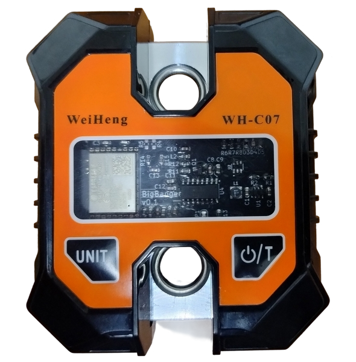

# BigBanger :boom:

<p align="center">
  
</p>

BigBanger is an ESP32-based open-source project that combines firmware and hardware to create a Bluetooth-enabled scale, mainly designed for climbing training.

This scale is fully compatible with the [Tindeq Progressor API](https://tindeq.com/progressor_api/), enabling easy integration with apps that support them, including the official Tindeq Progressor app.

The BigBanger board is designed to exploit the housing of cheap scales that you can buy on Amazon/Aliexpress.

Currently, the supported housing are:

* [WeiHeng WH-C07](https://it.aliexpress.com/item/1005004488455473.html?spm=a2g0o.productlist.main.45.6640ebyYebyYDH&algo_pvid=4eb4987b-360f-48ef-b21f-248b90a92ae2&algo_exp_id=4eb4987b-360f-48ef-b21f-248b90a92ae2-22&pdp_npi=4%40dis%21EUR%2122.65%2113.59%21%21%2122.91%2113.75%21%40210388c917363545957476762e73f7%2112000029333412625%21sea%21IT%21185384505%21X&curPageLogUid=mN6PXk7hKujt&utparam-url=scene%3Asearch%7Cquery_from%3A)
* [WeiHeng WH-C100](https://it.aliexpress.com/item/1005007661854154.html?spm=a2g0o.productlist.main.17.6640KMtfKMtfLb&algo_pvid=460fc652-4241-4711-9569-1d04a7b966ac&algo_exp_id=460fc652-4241-4711-9569-1d04a7b966ac-8&pdp_npi=4%40dis%21EUR%2137.58%2118.79%21%21%21276.32%21138.16%21%40210384b217385760281077417e6aa7%2112000041701557701%21sea%21IT%21185384505%21X&curPageLogUid=ai0LjxSLr64K&utparam-url=scene%3Asearch%7Cquery_from%3A)

This is not the first open-source Tindeq Progressor-like project. The [hangman](https://github.com/kesyog/hangman) is a very similar example. BigBanger was developed from scratch as a personal learning experience.

## Repository structure

* **firmware**: contains the micropython firmware for the ESP32

* **hardware**: contains the Kicad project for the PCB

## Prerequisite

* Python 3.7 or newer

* [esptool](https://docs.espressif.com/projects/esptool/en/latest/esp32/index.html)

* [rshell](https://github.com/dhylands/rshell)

## How-to

1. Build the PCB from the Kicad project. Design is fully compliant with [JLCPCB rules](https://jlcpcb.com/capabilities/pcb-capabilities)

    * The JLCPCB gerbers and assembly files are available in the [release page](https://github.com/FilMarini/bigbanger/releases/tag/v1.0)

    * If you assemble the PCB with JLCPCB, go to step 3

2. Buy the components. [Here](https://www.digikey.it/it/mylists/list/KCSV7UEBPS) is a full Digikey list of parts

3. Get to soldering!

    Battery wiring:
    
    * B+: Red
    * B-: Black

    Load cell wiring:
    
    * E-: Black
    * A-: White
    * A+: Green
    * E+: Red

4. Turn on the BigBanger and connect to PC using the microUSB

    * Device should appear as `/dev/ttyACM*` or `/dev/ttyUSB*`


6. Flash the ESP32 micropython firmware. Instructions and firmware files are [here](https://micropython.org/download/ESP32_GENERIC_C3/)

7. Copy the `.py` files in the 'firmware' folder into the ESP32. Copy the `hx711_gpio.py` file into the ESP32. For this you can use [rshell](https://github.com/dhylands/rshell)

   * Modify the `main.py` file. You need to specify the Bluetooth name for your device (If you want it compatible with the Tindeq Progressor, name must start with `Progressor`) as well as the crane scale used (Supported values are `WH-C07` and `WH-C100`)

    * With [rshell](https://github.com/dhylands/rshell):
    
       ```bash
       git clone --recursive https://github.com/FilMarini/bigbanger.git
       cd bigbanger/firmware
       rshell -p /dev/tty<your device> cp bb_gatt_server.py ble_advertising.py config.py hx711_bb.py utils.py hx711/hx711_gpio.py main.py /pyboard # Probably requires sudo privileges
       ```

    

9. Start training!

## Calibration

The BigBanger scale comes pre-calibrated, but if for any reason the calibration is lost, you can recalibrate it using the built-in two-point calibration system. This system requires two weight measurements with a 10 kg difference—typically one at zero weight and another at 10 kg.

### How to calibrate

- Turn on the BigBanger scale and ensure it is disconnected from any device.

- Press and hold the Unit button until the LED D5 turns on (this takes a few seconds).

- When the LED turns on, the scale performs the first measurement (normally at zero weight).

- Add 10 kg weight on the scale.

- Press the Unit button again. The LED D5 should turn off.

- The scale is now calibrated and you can now connect to it.

## Acknowledgements

Huge thanks to [Tindeq](https://tindeq.com/product/progressor/) for improving climbing training for all of us with their innovative product and for making their API available to third-party developers, enabling projects like this one. If you find this useful, consider supporting them by getting one of their products—they’re well worth it!
